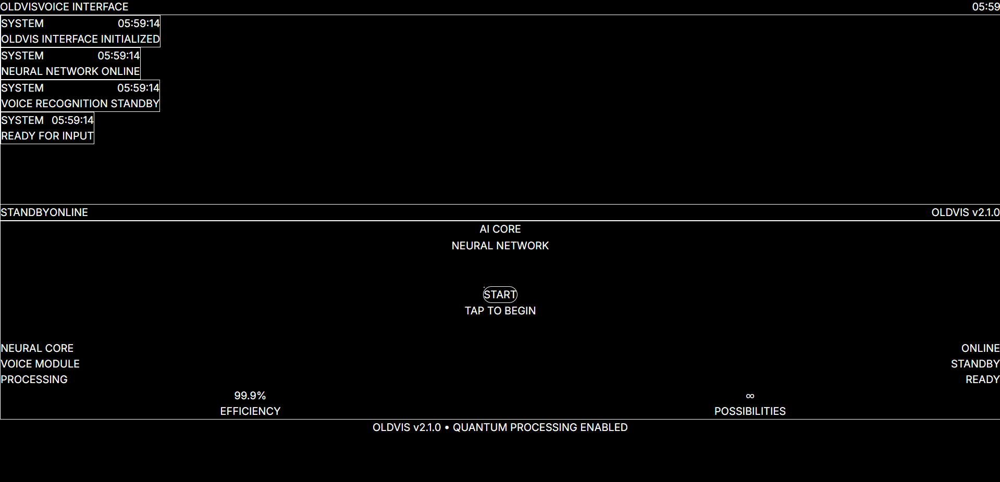
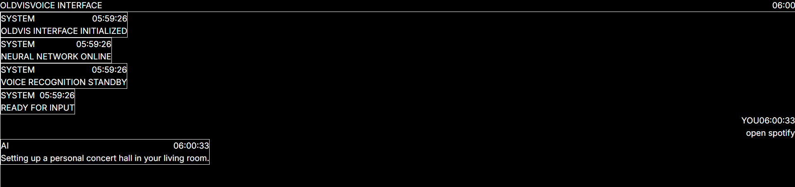
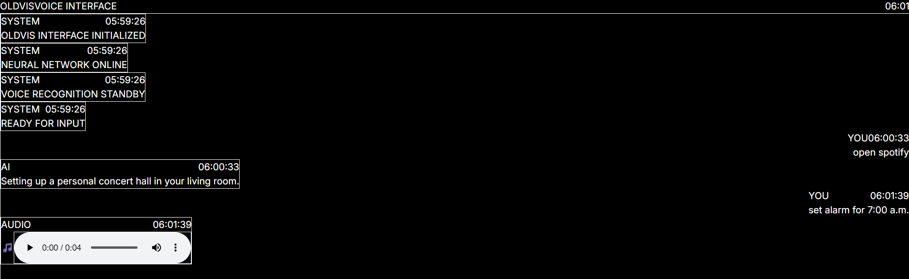

[OLDVIS] 🎯

Basic Details
Team Name: [Winter Coders]

Team Members:

Team Lead: [Mohamed Razin Mujeeb] - [Adi Shankara Institute of Engineering and Technology]

Member 2: [Aldrin Johny] - [Adi Shankara Institute of Engineering and Technology]

Project Description

AI That Mishears You On Purpose" is a chaotic voice assistant that intentionally misinterprets your voice commands into absurd, funny, or mildly terrifying responses. It blends speech recognition, randomized logic, and glitchy audio/text feedback to deliver an unpredictable interactive experience.

The Problem (that doesn't exist)

AI bots nowadays are way too intelligent. Lets humanize them a bit. What if your AI chatbot was a 60 year old man with hearing difficulties and dementia? 

The Solution (that nobody asked for)

Build a deliberately mishearing AI assistant that mimics the behavior of a confused yet entertaining old man who constantly misunderstands you — on purpose.

Technical Details

Technologies/Components Used

For Software: Visual Studio Code

[Languages used] - React, Js, html, css

[Frameworks used] - React, Vite

[Libraries used] -  

[Tools used] - AI tools, photoshop, audacity

For Hardware:

[List main components] - Laptop or PC with a microphone and speaker, Internet connection

[List specifications] - Browser supporting Web Speech API (Chrome), Basic audio playback support (HTML5 Audio)

[List tools required] - VS Code / Code Editor, Node.js, Git, Browser (preferably Chrome)

Implementation

For Software:

Installation

Clone the repository:

git clone https://github.com/razinnnit/useless_project.git

npm install

Run

npm run dev

(Open http://localhost:5173 or similar in browser)

Project Documentation

For Software:

Screenshots 

Landing Page This is the landing page of our chatbot. Click 'Start' button below to turn on mic and speak.

Convo 1 Conversation between user and bot after voice input. User input is shown right side and AI response is shown left side. 

Convo 2 In the second input the AI responds with a voice message! 

Project Demo

Video

[Video demonstrates the working of the chatbot](https://drive.google.com/file/d/1jW85ytsv9DjjCCdkmDuJ69r8F6lTHp-m/view?usp=sharing)

URL for website: https://github.com/razinnnit/uselessproject_2025.git

Team Contributions

Mohamed Razin Mujeeb: Backend

Aldrin Johny: Frontend

Made with ❤️ at TinkerHub Useless Projects

